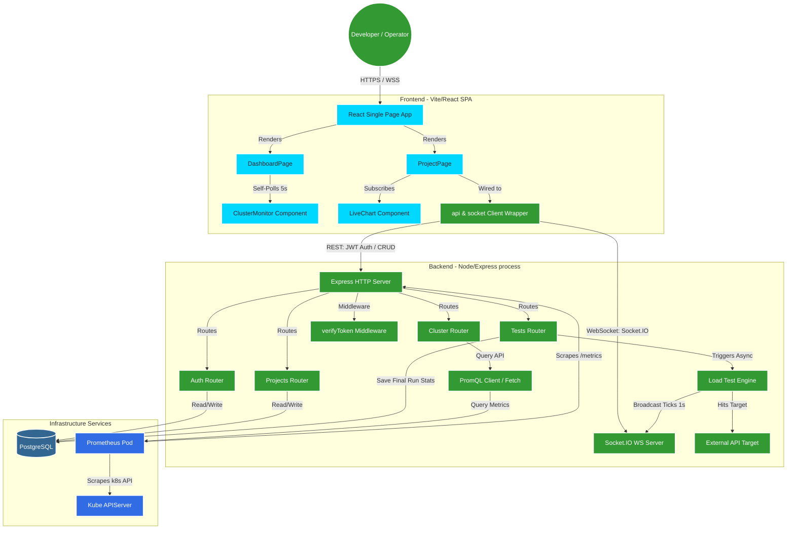

# PULSEBENCH: DEEP ARCHITECTURAL CODE REVIEW & STUDY GUIDE

---

## 1. High-Level Project Overview

**PulseBench** is a lightweight, self-contained, and highly visual DevOps stress-testing and cluster monitoring system designed for small engineering teams. Rather than relying on external load-testing tools (like JMeter or k6) or heavyweight monitoring stacks (like Datadog), PulseBench consolidates stress generation, real-time analytics streaming, and Kubernetes cluster telemetry into a unified, low-overhead single-process node server and a responsive single-page React frontend.

### Core Value Proposition
- **In-Process Load Testing:** Fires stress-test runs from the backend application process with configurable rates (Reqs/Sec) and patterns (Constant, Ramp-Up, Traffic Spike).
- **Sub-Second Telemetry Streams:** Employs Socket.IO to broadcast running metrics (latencies, success rates, aggregate averages, and P95 statistics) on every tick without hitting or polling the primary transactional database.
- **Agentless Cluster Monitoring:** Connects directly to the cluster's internal Prometheus instance to dynamically pull CPU utilization, memory allocation, and replica pod states across a specific Kubernetes namespace using native PromQL queries.
- **Rule-Based Recommendation Engine:** Post-processes load results using a custom rule engine to classify latency patterns and failure envelopes, delivering auto-tuned optimizations (e.g., advising caching, connection pooling, or replica scale-ups) instantly.

### Architectural Trade-Offs & Production Considerations
As a system designed for clear architectural demonstration and fast deployment, PulseBench makes deliberate compromises that are critical talking points in any Senior or Staff-level interview:

1. **In-Process Load Generation vs. Distributed Workers:**
   - *The Trade-off:* PulseBench executes HTTP load testing in the main Node.js process using asynchronous loops. This keeps deployment extremely simple.
   - *The Bottleneck:* Node.js is single-threaded. Firing thousands of fetch requests per second blocks the single event loop, starves CPU time for incoming API requests, and degrades WebSocket connection stability. Under heavy stress, the tool's load-generation capacity saturates, and the latencies recorded may reflect the backend's resource constraints rather than the target's limits.
   - *The Production Solution:* Decouple load generation to ephemeral Kubernetes Jobs running distributed load generators (e.g., written in Go/C++) and aggregate results asynchronously back to the primary database.

2. **Sequential Requests with Sleep Padding:**
   - *The Trade-off:* The load loop in `tests.ts` fires a request, awaits its completion, and then sleeps for a duration computed from the desired rate (`delayMs = 1000 / rate`).
   - *The Bottleneck:* Because it awaits the response before initiating the sleep delay, the request loop is synchronous per run. If a target server becomes highly latent (e.g., takes 2 seconds to respond), the generation rate drops dramatically, deviating from the target request-per-second setting.
   - *The Production Solution:* Implement an execution schedule based on non-blocking timer triggers or parallelized execution queues (like worker pools) where requests are fired concurrently without blocking on previous resolutions.

3. **In-Memory Metric Buffering:**
   - *The Trade-off:* To avoid database write saturation, real-time metrics are computed from an in-memory latency array, and are only written to PostgreSQL once upon completion.
   - *The Bottleneck:* If the backend container crashes or experiences an out-of-memory error (OOM) mid-test, all ongoing telemetry and test run metrics are permanently lost.
   - *The Production Solution:* Write ticks into a high-throughput time-series database or stream log lines through a message broker (e.g., Redis Streams, Kafka) to keep state durable.

---

## 2. Architecture Diagram (Mermaid)

### System Component & Data Flow Topology



### Step-by-Step Execution Sequence (Spawning a Load Test)

```mermaid
sequenceDiagram
    autonumber
    actor Dev as Developer (Browser)
    participant Client as client.ts
    participant Tests as routes/tests.ts (Express)
    participant Socket as websocket.ts (Socket.IO)
    participant DB as Postgres (Prisma)
    participant Target as Target Endpoint

    Dev->>Client: Input test parameters & click "Launch"
    Client->>Tests: POST /api/tests { endpointId, numRequests, rate, pattern } (JWT Attached)
    Tests->>DB: prisma.testRun.create({ status: "running" })
    DB-->>Tests: Return TestRun Record with UUID
    Tests-->>Client: HTTP 200 OK { testId: UUID }
    
    Note over Client,Socket: Establish stream tunnel
    Client->>Socket: Socket.emit('join_test', testId)
    Socket->>Socket: Join Socket.IO Room: test:{testId}
    
    Note over Tests,Target: Asynchronous firing loop runs in background
    rect rgb(20, 30, 40)
        loop Over numRequests
            Tests->>Target: HTTP Fetch (GET/POST/etc.)
            Target-->>Tests: HTTP Response / Error
            Note over Tests: Record latency & result status (Success/Failure)
            alt Every 1 Second Tick
                Tests->>Socket: io.to(room).emit('test_tick', CurrentStats)
                Socket-->>Client: WS Broadcast 'test_tick'
                Client->>Dev: Update LiveChart Data Points
            end
        end
    end

    Note over Tests: Test loop complete. Run analytical processing.
    Tests->>Tests: Compute final statistics (Avg Latency, P95, success/fail ratios)
    Tests->>Tests: Execute rule-based Recommendation Engine
    Tests->>DB: prisma.testRun.update({ status: "completed", ...finalStats })
    Tests->>Socket: io.to(room).emit('test_complete', FinalStats + Recommendation)
    Socket-->>Client: WS Broadcast 'test_complete'
    Client->>Dev: Render Final Telemetry, Stop Spinning, Inject Recommendation
    
    Client->>Client: Fetch project details (HTTP GET /api/projects/:id)
    Client->>Dev: Refresh historical runs list table
```



---

## 3. Complete Folder Structure with Explanation

```
E:\PulseBench\
├── .github/
│   └── workflows/
│       └── ci.yml             # Github Actions Workflow: Compiles code and runs TS checks on PR/Push
├── backend/                   # Node.js Express & TypeScript REST API & WebSocket process
│   ├── .dockerignore          # Excludes node_modules and builds from Docker context
│   ├── Dockerfile             # Multi-stage container instructions for production-optimized slim build
│   ├── package.json           # Specifies backend script aliases, dependencies, and type-declarations
│   └── src/
│       ├── server.ts          # Root entry point; bootstraps Express, HTTP Server, Websockets, and Prom-Client
│       ├── websocket.ts       # Exposes Socket.IO engine setup and manages client rooms
│       ├── middleware/
│       │   └── auth.ts        # Route protection middleware; decrypts JWTs and injects userId
│       ├── prisma/
│       │   └── schema.prisma  # Declarative database model, configurations, and PostgreSQL adapter mapping
│       └── routes/
│           ├── auth.ts        # Register/Login router; integrates BCrypt hashing and JWT signature
│           ├── cluster.ts     # Telemetry router; maps PromQL queries directly from Prometheus
│           ├── projects.ts    # REST CRUD endpoint handlers for workspaces (projects) and API targets
│           └── tests.ts        # Real Core: contains HTTP load-test runner loop and recommendation rules
├── frontend/                  # React & Vite & Tailwind CSS Single Page Application
│   ├── Dockerfile             # Alpine-based build; compiles production dist and hosts on lightweight HTTP server
│   ├── index.html             # Host DOM container for React's mount point
│   ├── package.json           # Frontend modules (Vite, Recharts, Lucide, Tailwind, Socket.IO Client)
│   ├── postcss.config.js      # PostCSS orchestrator compiling CSS directives for Vite
│   ├── tailwind.config.js     # Declares custom neon colors, utility grids, and theme extensions
│   ├── vite.config.ts         # Vite asset configurations and build transpilation pipeline setup
│   └── src/
│       ├── App.tsx            # Main router; maps public routes vs PrivateRoute JWT middleware components
│       ├── index.css          # Injects Tailwind layer directives and global cyber-grid backgrounds
│       ├── main.tsx           # Mounts the root Virtual DOM tree into index.html
│       ├── components/
│       │   ├── ClusterMonitor.tsx # Stat deck card components; polls Prometheus cluster metrics
│       │   ├── Layout.tsx     # Full page navigation frame with dynamic workspace scope and status indicators
│       │   ├── LiveChart.tsx  # Interactive charting overlay using Recharts with multi-metrics tab controls
│       │   └── Navbar.tsx     # Fallback simple header navbar for un-scoped views
│       ├── pages/
│       │   ├── DashboardPage.tsx # Overview page managing active projects and cluster monitoring
│       │   ├── LoginPage.tsx  # Dynamic registration/login toggled form with unified validation errors
│       │   └── ProjectPage.tsx   # Powerhouse view: API target manager, test controller, live telemetry logs, and comparison tables
│       └── services/
│           └── client.ts      # Unified API fetch wrappers and single-instance WebSocket state managers
├── k8s/                       # Production-grade Kubernetes deployment YAMLs
│   ├── backend.yaml           # Backend Deployment and NodePort Service with liveness and readiness probes
│   ├── frontend.yaml          # Frontend deployment static web serving configuration
│   ├── postgres.yaml          # Persistent stateful volume mappings and database deployments
│   ├── prometheus.yaml        # Prometheus container with internal ClusterRole and cluster-pod scrape scopes
│   └── secret.yaml            # Environment base64 Opaque container configuration for credentials and database strings
├── docker-compose.yml         # Local development orchestrator setting up Postgres, Backend, and Frontend
├── ARCHITECTURE.md            # Structural markdown document detailing the 5-day solo-build architecture
└── README.md                  # Root documentation detailing setup, configuration, and structural features
```

---

## 4. Entry Point and Startup Sequence

Understanding the exact sequence of initialization is crucial for diagnosing boot-up races (e.g., trying to run queries before the database is ready).

### 4.1 Backend Bootup Sequence (Process Initialization)
When `npm run start` or the container starts up, the entrypoint executing `node dist/server.js` triggers the following pipeline:

1. **Environment & Core Module Initialization:** 
   Imports Express, HTTP module, Socket.IO, CORS, and `prom-client`.
2. **WebSockets Instantiation:**
   `setupWebsocket(httpServer)` runs immediately. It wraps the raw HTTP server in a `socket.io` instance, configures permissive CORS origins, and defines default event handlers for `connection`.
3. **Prometheus Metrics Hook:**
   `client.collectDefaultMetrics()` is called inside `server.ts`. This immediately spawns a background collector thread inside Node's C++ binding layer to poll runtime metrics (V8 heap size, event loop lag, file descriptors, CPU usage) every 10 seconds.
4. **Middleware Injection:**
   Injects global CORS and Express JSON payload parsers. It inserts a custom HTTP interceptor:
   ```typescript
   app.use((req, res, next) => {
     res.on('finish', () => {
       httpRequestCounter.inc({ method: req.method, path: req.path, status: res.statusCode });
     });
     next();
   });
   ```
   This captures the response metrics for every REST transaction.
5. **Route Registration:**
   The Express router mounts all sub-routers:
   - `/api/auth` (Public)
   - `/api/projects` (Behind `verifyToken`)
   - `/api/tests` (Behind `verifyToken`; passes the active `io` WebSocket server to the route factory `createTestRoutes(io)`)
   - `/api/cluster` (Behind `verifyToken`)
6. **Port Binding:**
   The server binds to `PORT` (default 4000) using `httpServer.listen()`.

### 4.2 Frontend Bootup Sequence
1. **HTML Parsing:**
   The browser loads `index.html`, which references `<script type="module" src="/src/main.tsx">`.
2. **Virtual DOM Insertion:**
   `main.tsx` mounts the `<App />` element within the `<div id="root">` element.
3. **Router Mounting:**
   `App.tsx` configures the `BrowserRouter`, defining Route paths. Wrap-around route guards (`PrivateRoute`) query `isLoggedIn()` (which checks `localStorage` for a non-null token string).
4. **State Hydration:**
   If authenticated, `DashboardPage` or `ProjectPage` mounts. The page triggers its `useEffect` hooks:
   - Dashboard: Triggers `loadProjects()` and starts a 5-second `ClusterMonitor` poll timer.
   - Project: Invokes `loadProject()`, executes `socket.connect()` to perform the WebSocket upgrade handshake, and registers event listeners (`test_tick`, `test_complete`).

### 4.3 Kubernetes Bootstrap and Probes Execution
During a deployment sequence on a cluster, the `kubelet` initializes containers and executes health assessments:
1. **PostgreSQL Pod Bootup:** Spawns and maps to PV/PVC storage on host path.
2. **Prometheus Config Map & ClusterRole Binding:** Allocates a ServiceAccount allowing Prometheus to poll the Kubernetes API.
3. **Backend Container Spawn:**
   - **Readiness Probe:** Executes an HTTP `GET /health` against port 4000 every 10 seconds (starting after an initial delay of 5s). If it returns a `200 OK`, the container is marked as "Ready" and the Service controller routes client traffic to it.
   - **Liveness Probe:** Executes `GET /health` with an initial delay of 10s. If the Express server fails this probe repeatedly (e.g., due to an event loop deadlock caused by a massive load test blocking thread execution), Kubernetes restarts the container.

---

## 5. Request Lifecycle

The system supports two core request lifecycles: a standard REST request-response transaction and an asynchronous WebSocket-driven load-test lifecycle.

### 5.1 Standard REST Lifecycle (e.g., `GET /api/projects`)

```
[Browser Client]
       │
       ▼ (1) HTTP Request with Header: "Authorization: Bearer <JWT>"
[Express Router: server.ts]
       │
       ▼ (2) Matches path: /api/projects
[auth.ts Middleware]
       │   ├─ Extracts JWT. Checks signature with JWT_SECRET.
       │   ├─ Decodes token: { userId: "UUID" }
       │   └─ Injects req.userId = "UUID"
       ▼ (3) Passes execution via next()
[projects.ts Router]
       │   ├─ Invokes Prisma client: prisma.project.findMany({ where: { userId } })
       │   └─ Translates ORM to SQL: SELECT * FROM "Project" WHERE "userId" = 'UUID';
       ▼ (4) SQL executed on DB
[PostgreSQL Database]
       │
       ▼ (5) Returns raw data row records
[Prisma ORM Layer]
       │   └─ Deserializes rows into JSON array structure
[projects.ts Router]
       │
       ▼ (6) Sends Response: res.json(projects)
[Express Server Middleware]
       │   └─ Fires res.on('finish') event listener
       │   └─ Increments Prometheus metric: httpRequestCounter.inc({method: "GET", path: "/api/projects", status: 200})
       ▼ (7) Emits raw byte-stream payload over TCP
[Browser Client]
```

### 5.2 Asynchronous Load Test Run Lifecycle

1. **Submission:** Client triggers `POST /api/tests` passing JSON configuration.
2. **ORM Write:** `tests.ts` creates a `TestRun` record in Postgres with a status of `"running"`.
3. **REST Return:** The API responds with `200 OK` and the newly generated `{ testId }` UUID. This rapid response unblocks the frontend UI.
4. **WebSocket Join:** The frontend immediately emits `join_test` with the `testId` via its socket client. The backend Socket.IO router intercepts this and joins the client socket to a room named `test:${testId}`.
5. **Load Generator Boot:** The asynchronous firing engine `runLoadTest(...)` is spawned as a background promise chain (using `.catch()` to prevent uncaught exceptions from crashing the process).
6. **Execution Loop & Metrics Collection:**
   - The engine iterates through the requested quantity of requests (`numRequests`).
   - For each request, it fires a `fetch()` call, records the time delta, and updates in-memory trackers (`success`, `failed`, `latencies` array).
7. **WebSocket Ticks:** A 1-second interval timer invokes `emitTick()`. It extracts stats, calculates P95 latencies in memory, and broadcasts a `test_tick` message specifically to the Socket.IO room `test:${testId}`.
8. **Aggregation & Evaluation:**
   Once the iteration completes, the background loop:
   - Clears the interval timer.
   - Runs final aggregate metrics calculations (averages, P95).
   - Executes the recommendation rule engine.
9. **Final Persistence:** Updates the database record for `testId` in Postgres, changing the status to `"completed"` and saving the finalized stats.
10. **WebSocket Completion:** Broadcasts `test_complete` with final metrics and the diagnostic recommendation text.
11. **Frontend Refresh:** The frontend receives `test_complete`, updates the charts, and re-fetches the project details (`GET /api/projects/:id`) to display the updated run in the history table.

---

## 6. Database Interactions and Schema Analysis

PulseBench uses PostgreSQL as its transactional database system, managed via the Prisma ORM.

### 6.1 Entity-Relationship (ER) Diagram (Crow's Foot Notation)

```
  +--------------+
  |     User     |
  +--------------+
  | id (PK)      |<----+
  | email (UQ)   |     | (1:N)
  | passwordHash |     |
  | name         |     |
  +--------------+     |
                       |
  +--------------+     |
  |   Project    |-----+
  +--------------+
  | id (PK)      |<----+
  | name         |     | (1:N)
  | userId (FK)  |     |
  +--------------+     |
                       |
  +--------------+     |
  |   Endpoint   |-----+
  +--------------+
  | id (PK)      |<----+
  | projectId(FK)|     | (1:N)
  | name         |     |
  | url          |     |
  | method       |     |
  +--------------+     |
                       |
  +--------------+     |
  |   TestRun    |-----+
  +--------------+
  | id (PK)      |
  | endpointId(FK|
  | numRequests  |
  | requestsPerSec|
  | pattern      |
  | status       |
  | totalRequests|
  | successRequests
  | failedRequests
  | avgLatencyMs |
  | p95LatencyMs |
  | recommendation
  | createdAt    |
  +--------------+
```

### 6.2 Relational Model Analysis

- **User Model:** Stores essential identity attributes. `id` uses a default UUID generator to prevent ID guessing and enumeration attacks. It holds a unique constraint on `email`.
- **Project Model:** Represents isolated developer workspaces. Each workspace maps back to a single `User` (1-to-Many).
- **Endpoint Model:** Configures stress-test targets. It maps back to a `Project` (1-to-Many), defining properties like `url` and `method` (with a default of `'GET'`).
- **TestRun Model:** Stores historical test executions. It references an `Endpoint` (1-to-Many). Fields storing outcomes (`avgLatencyMs`, `p95LatencyMs`, `totalRequests`, `successRequests`, `failedRequests`, and `recommendation`) are nullable (`?`), allowing the record to be created in a `"running"` state and populated later on completion.

### 6.3 DB Query Efficiency and Index Analysis

Reviewing database index layouts is a core Staff Engineer skill. Under a default Prisma PostgreSQL setup:
1. **Implicit Indexes:** Unique constraint columns (like `User.email`) and Primary Keys automatically generate B-tree indexes.
2. **Missing Foreign Key Indexes (Crucial Interview Point):** 
   - *The Issue:* Prisma **does not** automatically index foreign key fields (like `Project.userId`, `Endpoint.projectId`, or `TestRun.endpointId`).
   - *The Impact:* When loading `DashboardPage`, we query `prisma.project.findMany({ where: { userId } })`. When loading `ProjectPage`, we query `prisma.project.findFirst({ where: { id: projectId, userId } })`. Because `userId` is not indexed, Postgres must execute a **Full Table Scan** (sequential scan) to find matching projects. As the database grows to thousands of records, loading the dashboard slows down significantly.
   - *The Fix:* Add explicit indices inside `schema.prisma` using the `@@index` attribute:
     ```prisma
     model Project {
       ...
       @@index([userId])
     }
     model Endpoint {
       ...
       @@index([projectId])
     }
     model TestRun {
       ...
       @@index([endpointId])
     }
     ```

---

## 7. Docker and Deployment Flow

### 7.1 Backend Dockerfile Analysis

```dockerfile
# Stage 1: Build & Package Isolation
FROM node:20-bookworm-slim

WORKDIR /app

# Ensure security patch packages and Prisma engine SSL dependencies are satisfied
RUN apt-get update && \
    apt-get install -y openssl libssl-dev && \
    rm -rf /var/lib/apt/lists/*

COPY package*.json ./

RUN npm install

COPY . .

# Generate native runtime client tailored for local container architecture
RUN npx prisma generate

RUN npm run build

EXPOSE 4000

CMD ["node", "dist/server.js"]
```

#### Key Details
- **Base Image:** Uses `node:20-bookworm-slim` rather than a full operating system image. It contains only the dependencies required to run Node, keeping the image size small.
- **Dependency Cache:** Copies `package*.json` first and runs `npm install` *before* copying the rest of the source files. This takes advantage of Docker's layer caching, meaning dependencies are only reinstalled if the `package.json` file changes.
- **Prisma Client Isolation:** `npx prisma generate` creates the Prisma client artifacts inside `node_modules/.prisma/client`. Running this step before compiling guarantees that TypeScript type checks pass during the build step.

### 7.2 Frontend Dockerfile Analysis

```dockerfile
FROM node:20-alpine

WORKDIR /app

COPY package*.json ./
RUN npm install

COPY . .
RUN npm run build

EXPOSE 3000
CMD ["npx", "serve", "-s", "dist", "-l", "3000"]
```

#### Key Details
- **Serve Utility:** Employs a lightweight, non-interactive static file server (`serve`) to host Vite's compiled JavaScript, CSS, and HTML assets from the `/dist` output directory.
- **SPA Routing Support:** The `-s` option routes all fallback requests to `index.html`. This is necessary for client-side routing libraries (like `react-router-dom`) to function correctly when users refresh deep pages (e.g., `/projects/uuid`).

### 7.3 Kubernetes Deployment and RBAC Telemetry Architecture

The deployment uses five declarative Kubernetes manifest configurations under the custom namespace `pulsebench`.

#### The Prometheus RBAC Loop (`prometheus.yaml`)
Prometheus cannot query pod status or scrape metrics inside a Kubernetes cluster without explicit permissions. PulseBench sets up RBAC permissions to allow this:

1. **ServiceAccount:** Creates a service account named `prometheus` inside the `pulsebench` namespace.
2. **ClusterRole:** Declares a set of system-wide permissions under `prometheus-reader`:
   ```yaml
   rules:
     - apiGroups: [""]
       resources: ["nodes", "nodes/metrics", "services", "endpoints", "pods"]
       verbs: ["get", "list", "watch"]
   ```
3. **ClusterRoleBinding:** Associates the `prometheus-reader` ClusterRole with the `prometheus` ServiceAccount, granting the Prometheus server permissions to discover endpoints within the cluster.
4. **Scrape Config Configuration:**
   Using a `ConfigMap`, Prometheus is configured to scan all active pods under the `pulsebench` namespace. It scrapes metrics from the backend's `/metrics` endpoint on port 4000 every 15 seconds.

---

## 8. External Dependencies and Why They Are Used

Selecting the right dependencies is critical to maintaining a clean, highly performant architecture.

### 8.1 Backend Production Dependencies
- **`@prisma/client` (v5.18.0):** An ORM that generates query types directly from the database schema, reducing run-time SQL syntax errors and accelerating development.
- **`express` (v4.19.2):** A lightweight HTTP routing library with middleware support.
- **`socket.io` (v4.7.5):** A robust WebSocket library. It manages fallbacks, ping/pong health heartbeats, auto-reconnection, and client room segregation.
- **`bcrypt` (v5.1.1):** A password-hashing library. It automatically handles random salting and applies CPU-bound work factors to secure passwords against GPU-accelerated brute-force attacks.
- **`jsonwebtoken` (v9.0.2):** Implements JWT signing and validation, providing stateless user authentication.
- **`prom-client` (v15.1.3):** The official Prometheus client library for Node.js. It collects system metrics (heap usage, event loop lag) and custom application metrics (like `http_requests_total`).

### 8.2 Frontend Production Dependencies
- **`react-router-dom` (v6):** Handles client-side navigation and route parameters without requiring full-page reloads.
- **`recharts` (v2):** A charting library built specifically for React, using standard SVG nodes to render interactive charts.
- **`socket.io-client` (v4.7.5):** The client companion to the backend Socket.IO engine. It manages the connection lifecycle and streams metric ticks directly to page state.
- **`lucide-react` (v0):** A clean icon pack compiled as individual SVG wrapper components, supporting tree-shaking to keep the overall build bundle small.

---

## 9. Most Important Files Ranked by Importance

| Rank | File Path | Impact / Architectural Significance |
|:---:|---|---|
| **1** | `backend/src/routes/tests.ts` | **The Core Engine.** Handles load-test execution, patterns, statistics calculations (average, P95), and the recommendation engine. |
| **2** | `backend/src/server.ts` | **The Bootstrapping Hub.** Initializes HTTP, Express, WebSockets, global telemetry intercepts, and mounts application routers. |
| **3** | `backend/src/prisma/schema.prisma` | **Database Blueprint.** Defines the data models, relations, schemas, and target engine parameters. |
| **4** | `frontend/src/pages/ProjectPage.tsx` | **Main User Dashboard.** Links API targets, stress controls, live socket metrics, and run history comparisons on a single screen. |
| **5** | `backend/src/websocket.ts` | **WebSocket Orchestrator.** Manages room assignments for active stress runs. |
| **6** | `backend/src/routes/cluster.ts` | **Cluster Telemetry Interface.** Transforms PromQL metrics into API JSON payloads to feed the frontend dashboards. |
| **7** | `frontend/src/services/client.ts` | **Data Exchange Layer.** Consolidates client-side authentication, fetch headers, and WebSocket singleton instances. |
| **8** | `frontend/src/components/LiveChart.tsx` | **Visual Analytics Dashboard.** Real-time visual interface displaying latency, throughput, and success rate trends. |
| **9** | `k8s/prometheus.yaml` | **Kubernetes Operations Configuration.** Defines RBAC policies and scrape rules that allow Prometheus to query cluster metrics. |
| **10**| `backend/src/middleware/auth.ts` | **Security Gateway.** Verifies incoming REST requests by checking JWT authorization signatures. |

---

## 10. Exact Order in which to Read the Codebase

To understand the codebase thoroughly enough to explain every detail in an interview, read files in this specific sequence:

### Phase 1: Conceptual Foundations
1. **`ARCHITECTURE.md`:** Understand the overarching system boundaries, design choices, and solo-build constraints.
2. **`backend/src/prisma/schema.prisma`:** Review the database models and relationships to understand how data is structured and stored.

### Phase 2: User Access & Authentication Flow
3. **`backend/src/middleware/auth.ts`:** Analyze how the JWT check protects routes and populates the `userId` payload.
4. **`backend/src/routes/auth.ts`:** See how registration handles BCrypt salting and how JWTs are signed.
5. **`frontend/src/services/client.ts`:** Trace how client REST requests append tokens and how the global Socket connection instance is managed.
6. **`frontend/src/pages/LoginPage.tsx`:** See how authentication state is managed in the UI.

### Phase 3: The Load-Testing Engine & Telemetry Stream
7. **`backend/src/websocket.ts`:** Understand how clients subscribe to real-time test run metrics via Socket.IO rooms.
8. **`backend/src/routes/tests.ts`:** Study the load-testing engine, request loop, latency calculations, and recommendation logic. This is the heart of the application.
9. **`frontend/src/components/LiveChart.tsx`:** Observe how Recharts parses streaming WebSocket metric events.
10. **`frontend/src/pages/ProjectPage.tsx`:** Review the main stress controller view, showing how all features integrate.

### Phase 4: Cluster Metrics & Operations
11. **`backend/src/routes/cluster.ts`:** Understand how PromQL metrics are pulled from Prometheus to check cluster CPU, memory, and pod usage.
12. **`frontend/src/components/ClusterMonitor.tsx`:** Trace how cluster metrics are polled and updated.
13. **`k8s/prometheus.yaml`:** Review the RBAC permissions and scrapers configured to read cluster data.

---

## 11. Deep File Analysis

---

### `backend/src/routes/tests.ts`

#### Purpose
This file contains the **load-testing engine**. It registers the routes to run load tests and fetches historical metrics. When a user spawns a stress test, this router records the initial setup, starts an asynchronous background request loop, and computes final statistics and operational recommendations once complete.

#### Key Functions & Types

- `createTestRoutes(io: Server): Router` (Factory Function)
  Creates the Express router instance. It accepts the Socket.IO instance as an argument, allowing the router to emit WebSocket events directly to client rooms without needing a separate websocket module wrapper.

- `runLoadTest(io, testId, url, method, numRequests, requestsPerSec, pattern)` (Core Async Engine)
  Manages the background execution loop. It tracks success rates and request latencies, coordinates the interval timer to emit real-time metrics, executes HTTP requests against the target URL, calculates the execution pattern delays, updates the database on completion, and broadcasts the final analytical summary.

- `computeStats(latencies: number[], success: number, failed: number): TickStats`
  Calculates aggregate statistics from the current array of request latencies.
  - *Avg Latency:* Sums latencies and divides by total request count.
  - *P95 Latency:* Sorts the latencies array in ascending order, grabs the value at index `Math.floor(length * 0.95)`, and returns it.

- `generateRecommendation(stats: TickStats, totalSent: number): string`
  An rules-based evaluation engine that analyzes results against pre-defined performance thresholds:
  - Error rate > 20%: Flags high error rates, indicating rate-limiting or service capacity exhaustion.
  - P95 Latency > 1000ms: Warns about high latency spikes and suggests caching or scale-up strategies.
  - Error rate > 5%: Advises investigating server error logs.
  - Average Latency < 200ms and no errors: Confirms target is handling load well.

#### Inputs and Outputs

##### `POST /api/tests`
- **Input (JSON Body):**
  ```json
  {
    "endpointId": "string-uuid",
    "numRequests": 100,
    "requestsPerSec": 10,
    "pattern": "constant | ramp | spike"
  }
  ```
- **Output (JSON):**
  ```json
  { "testId": "string-uuid" }
  ```

##### `runLoadTest(...)`
- **Inputs:** Parameters specifying target destination details, request quantities, execution rates, and distribution patterns.
- **Outputs / Side Effects:** Spawns asynchronous loops, initiates HTTP fetches against targets, updates PostgreSQL `TestRun` records, and emits WebSocket telemetry events.

#### Dependencies
- `express.Router`
- `@prisma/client` (Prisma Database connection client)
- `socket.io.Server`
- `fetch` (Native Node runtime Fetch API)

#### Why it exists
This file contains the core business logic of PulseBench. It isolates the HTTP execution loop, aggregate math operations, and target metrics analysis into a single service, keeping the core load testing logic modular and easy to manage.

---

#### Common Interview Questions & Expert Answers

##### Q1: How does PulseBench's sequential `for` loop using `await fireOne()` impact the accuracy of configured Request-Per-Second (RPS) metrics?
> **Answer:** Because the loop awaits `fireOne()` before applying the calculated delay (`sleep(delayMs)`), the time required to complete the HTTP request is added directly to the loop iteration time.
> 
> For example, if a user requests 10 RPS, the delay between requests should be 100ms. If the target server responds in 10ms, each iteration takes 110ms, yielding an actual rate of roughly 9 RPS (close to target). However, if the target server slows down and takes 900ms to respond, each iteration takes 1000ms, dropping the actual throughput to 1 RPS.
> 
> This synchronous execution model means the configured test rate will drop exactly when the target server starts struggling. In a production-grade load tester, requests should be triggered at precise intervals (using non-blocking timers) regardless of when previous requests resolve.

##### Q2: Calculate the Big-O Time and Space Complexity of the `computeStats` function. Why is it structured this way?
> **Answer:** 
> - **Time Complexity:** $O(N \log N)$, where $N$ is the number of recorded latencies. Calculating the average takes $O(N)$ time by iterating through the array. However, calculating the P95 latency requires sorting the latencies array, which takes $O(N \log N)$ time using JavaScript's native Timsort engine.
> - **Space Complexity:** $O(N)$ because sorting is performed on a shallow copy of the latencies array (`[...latencies]`), which prevents mutating the original array while a test run is in progress.
> 
> While copy-sorting is fine for a few hundred requests, under high-throughput testing with millions of requests, copy-sorting an array every second becomes highly inefficient. In a high-scale production system, we would use streaming quantile approximation algorithms (like **T-Digest** or **HdrHistogram**) to calculate P95 latencies in $O(1)$ space and $O(1)$ write time.

##### Q3: How does the asynchronous execution of `runLoadTest` affect error handling and process safety?
> **Answer:** Inside `POST /api/tests`, `runLoadTest` is triggered without an `await` modifier, and append a `.catch()` block to the promise:
> ```typescript
> runLoadTest(...).catch((err) => console.error(err));
> ```
> This is a critical pattern in Node.js. If an asynchronous function running in the background throws an exception and is not caught, it triggers an `unhandledRejection` event. In modern Node environments, this can crash the entire backend process. Appending `.catch()` ensures any exceptions during a load test (such as network drops or database connection failures) are caught and logged safely without taking down the server.

---

### `backend/src/server.ts`

#### Purpose
This file is the root entry point that bootstraps the entire backend server. It creates the Express application, wraps it in an HTTP server instance to support WebSocket connections, integrates Prometheus metrics collections, and mounts the application routes.

#### Key Functions & Types

- `httpRequestCounter` (Prometheus Counter)
  Tracks total incoming HTTP requests, recording the `method`, `path`, and response `status` code.

- `/metrics` (REST Endpoint)
  Exposes the Prometheus metrics registry. It sets the response content-type to match the format Prometheus expects, allowing external scrapers to parse performance data.

#### Inputs and Outputs

##### `GET /health`
- **Output (JSON):** `{ "status": "ok" }`

##### `GET /metrics`
- **Output (Text):** PromQL-compatible plain-text representation of all runtime system and application metrics.

#### Dependencies
- `express`, `cors`
- `http.createServer`
- `prom-client`
- Route modules (`auth`, `projects`, `cluster`, `tests`)
- `websocket.setupWebsocket`

#### Why it exists
This file bootstraps the application, coordinating HTTP, WebSockets, database clients, and Prometheus monitoring tools to prepare the backend for client connections.

---

#### Common Interview Questions & Expert Answers

##### Q1: Why does PulseBench wrap the Express `app` instance in an HTTP server using `createServer(app)` instead of calling `app.listen()` directly?
> **Answer:** Express's `app.listen()` is a utility helper that creates an HTTP server under the hood. However, to run WebSockets (Socket.IO) alongside our REST API on the same port, we need direct access to the underlying HTTP server instance.
> 
> By creating the server explicitly using `http.createServer(app)` and passing it to `setupWebsocket(httpServer)`, we allow both the Express routing engine and the Socket.IO WebSocket engine to share the same HTTP server and TCP port.

##### Q2: What is the purpose of registering the Prometheus interceptor *before* mounting any API routes?
> **Answer:** Express executes middleware sequentially in the order it is registered. By registering the Prometheus metric counter middleware first, we ensure it intercepts every incoming HTTP request.
> 
> The middleware registers an event listener on the response's `finish` event:
> ```typescript
> res.on('finish', () => { ... })
> ```
> This guarantees that the request duration and status code are recorded *after* the entire request has processed and sent, providing accurate metrics for every endpoint.

##### Q3: If a load test deadlocks Node's single thread, what happens to the `/health` endpoint and the container's Kubernetes status?
> **Answer:** Because Node.js is single-threaded, if a massive load test blocks the event loop, all incoming HTTP requests are queued behind the blocked task.
> 
> When the Kubernetes agent queries the `/health` endpoint for its readiness or liveness probe, the probe request will time out. If this happens repeatedly and exceeds the threshold defined in `backend.yaml`, Kubernetes marks the container as unhealthy and restarts it. To prevent this, CPU-intensive tasks like load testing should be offloaded to worker threads, separate processes, or distributed runner containers.

---

### `backend/src/routes/cluster.ts`

#### Purpose
Acts as a proxy query router for Kubernetes telemetry. It intercepts client requests, executes PromQL queries against the cluster's internal Prometheus instance, aggregates the responses, and returns CPU, memory, and running pod statistics to feed the frontend's telemetry cards.

#### Key Functions & Types

- `promQuery(query: string): Promise<number>`
  An internal helper that executes a PromQL query against the Prometheus API, extracts the resulting metric values, parses them as floats, and returns the computed numbers.

#### Inputs and Outputs

##### `GET /api/cluster`
- **Output (JSON):**
  ```json
  {
    "cpuPercent": 42.3,
    "memoryPercent": 78.1,
    "runningPods": 3
  }
  ```

#### Dependencies
- `express.Router`
- `fetch` (used to query Prometheus)

#### Why it exists
This file acts as a clean translation layer. Rather than exposing the entire Prometheus query API to the frontend, this router encapsulates PromQL queries and formats the results into a simple JSON payload, shielding the frontend from complex Prometheus query syntax.

---

#### Common Interview Questions & Expert Answers

##### Q1: Break down the PromQL query used to calculate namespace CPU utilization: `avg(rate(container_cpu_usage_seconds_total{namespace="pulsebench"}[1m])) * 100`.
> **Answer:** 
> 1. `container_cpu_usage_seconds_total`: A counter tracking the cumulative CPU time consumed by containers in seconds.
> 2. `{namespace="pulsebench"}`: Filters metrics to only include containers running in the `pulsebench` Kubernetes namespace.
> 3. `[1m]`: A range vector selector that looks at a 1-minute window of metric data.
> 4. `rate(...)`: Calculates the per-second rate of CPU increase over that 1-minute window.
> 5. `avg(...)`: Aggregates and averages the CPU rates across all active containers in the namespace.
> 6. `* 100`: Converts the resulting fractional value into a readable percentage.

##### Q2: Why is `Promise.all` used inside the `/api/cluster` endpoint instead of sequential `await` calls?
> **Answer:** If we used sequential `await` calls, we would block execution on each Prometheus query in series:
> ```typescript
> const cpu = await promQuery(...);
> const mem = await promQuery(...);
> const pods = await promQuery(...);
> ```
> If each query takes 100ms, the entire endpoint takes at least 300ms to respond. By wrapping the queries in `Promise.all([query1, query2, query3])`, the Node runtime fires all three network queries concurrently. This reduces the total response time to the duration of the slowest query (roughly 100ms), improving performance and API throughput.

##### Q3: How should we secure the Prometheus query endpoint in a production environment to prevent metrics exposure?
> **Answer:** In the current setup, Prometheus is exposed inside the Kubernetes cluster on port 9090 without authentication. This is fine for isolated internal networks, but in production, we should secure it:
> 1. **NetworkPolicies:** Use Kubernetes NetworkPolicies to block all traffic to Prometheus except from the backend service.
> 2. **Authentication Headers:** Configure basic auth or token-based authentication on Prometheus, and save the credentials securely in Kubernetes Secrets.
> 3. **Proxy Client Protection:** Ensure the backend's `/api/cluster` router is protected by token validation middleware (like our `verifyToken` middleware) to prevent unauthorized users from querying cluster performance.

---

### `backend/src/websocket.ts`

#### Purpose
Configures the Socket.IO WebSocket server. It maps client upgrade handshakes, handles connection events, and registers clients to specific room channels (`test:${testId}`) so they receive real-time metrics for the tests they are viewing.

#### Key Functions & Types

- `setupWebsocket(httpServer: HttpServer): Server`
  Configures a Socket.IO server with permissive CORS settings, enabling cross-origin browser requests.

- `join_test` (Incoming Client Event)
  Subscribes a client socket to a room based on the `testId` UUID, ensuring they only receive updates for that specific stress test.

#### Inputs and Outputs
- **Inputs (WebSocket Streams):** Accepts connection upgrades and processes incoming socket event requests.
- **Outputs / Emitters:** Emits real-time metric updates (`test_tick`) and final reports (`test_complete`) to subscribed client rooms.

#### Dependencies
- `socket.io`
- `http`

#### Why it exists
This module decouples the WebSocket server setup and event handlers from the main `server.ts` file, keeping client subscription and event-routing logic isolated and easy to maintain.

---

#### Common Interview Questions & Expert Answers

##### Q1: Why does PulseBench use Socket.IO's "Rooms" concept instead of broadcasting metric ticks globally to all connected clients?
> **Answer:** If we broadcasted metric ticks globally, every connected client would receive metrics for every test run in progress. This wastes network bandwidth and processing power, especially if multiple developers are running separate tests simultaneously.
> 
> By using Socket.IO's `socket.join(room)` to place clients in isolated `test:${testId}` rooms, we can target broadcasts to only the clients viewing that specific test:
> ```typescript
> io.to(`test:${testId}`).emit('test_tick', stats);
> ```
> This ensures clients only receive relevant metric updates, keeping network usage efficient.

##### Q2: Why is there no explicit `leave_test` event handler configured in `websocket.ts`?
> **Answer:** Socket.IO automatically manages room memberships when a client disconnects. If a user closes their browser or navigates away from the project page, Socket.IO cleans up their socket instance and removes them from any joined rooms automatically, preventing memory leaks without needing a manual `leave_test` listener.

##### Q3: How does Socket.IO maintain real-time connections if a client's network environment blocks WebSocket protocols?
> **Answer:** Socket.IO does not rely on WebSockets alone. It begins connection handshakes using standard HTTP long-polling (Engine.IO). Once established, it attempts to upgrade the connection to a true WebSocket connection in the background.
> 
> If a client's corporate firewall or proxy blocks WebSocket connections, Socket.IO gracefully falls back to HTTP long-polling, ensuring real-time metrics are still delivered.

---

### `backend/src/prisma/schema.prisma`

#### Purpose
Defines the database schema, entity relationships, and database engine parameters using Prisma's declarative schema syntax.

#### Database Configurations
- **Client Provider:** `prisma-client-js` (Generates the TypeScript database client).
- **Datasource Provider:** `postgresql` (Connects to our PostgreSQL database using the `DATABASE_URL` environment variable).

#### Model Entities
- `User`: Maps user identity records and maintains a 1-to-many relationship with `Project`.
- `Project`: Defines user workspaces and maintains a 1-to-many relationship with `Endpoint`.
- `Endpoint`: Defines the stress-test target URLs and methods, and maintains a 1-to-many relationship with `TestRun`.
- `TestRun`: Stores test parameters (request count, rate, pattern) and nullable columns for the final results, allowing records to be updated dynamically when tests complete.

#### Dependencies
- `prisma` (Schema compilation engine)

#### Why it exists
This schema acts as the single source of truth for the database structure. It replaces manual SQL table creation with migrations and generates TypeScript types for the database entities automatically.

---

#### Common Interview Questions & Expert Answers

##### Q1: Why are fields like `totalRequests`, `successRequests`, and `p95LatencyMs` marked as optional (`?`) in the `TestRun` model?
> **Answer:** When a user launches a stress test, a `TestRun` record is created immediately in a `"running"` state. At this point, the final test results (like latencies and success counts) are not yet known.
> 
> Marking these fields as optional allows us to save the initial run parameters in the database immediately, and update the record with final results once the test completes:
> ```typescript
> await prisma.testRun.update({
>   where: { id: testId },
>   data: { status: "completed", avgLatencyMs: ..., p95LatencyMs: ... }
> });
> ```

##### Q2: What are the advantages and disadvantages of using UUIDs (`@default(uuid())`) as primary keys instead of auto-incrementing integers?
> **Answer:** 
> - **Advantages:** UUIDs are globally unique and non-sequential. This prevents ID enumeration attacks (where an attacker guesses other records by incrementing an ID in an API URL). They also allow IDs to be generated safely on the client side without needing to query the database first.
> - **Disadvantages:** UUIDs are larger (128-bit vs. 32 or 64-bit integers), which increases storage overhead. Because they are random, they also cause page fragmentation on indexed columns, leading to slower write speeds on large tables compared to sequential integer keys.

##### Q3: How would you scale the database architecture if the `TestRun` table grows to hundreds of millions of records?
> **Answer:** 
> 1. **Table Partitioning:** Partition the `TestRun` table by range intervals based on the `createdAt` column (e.g., monthly partitions). This keeps indices small and allows old data to be archived easily.
> 2. **Database Sharding:** Shard the database horizontally by hashing the `projectId` or `userId`, routing workspace traffic to dedicated database nodes.
> 3. **Data Retention Policies:** Implement a data retention policy that aggregates historical tests into daily performance summaries, archiving raw run records after 30 to 90 days.

---

### `backend/src/middleware/auth.ts`

#### Purpose
Secures private API routes. It intercepts incoming HTTP requests, validates the signature of the attached JSON Web Token (JWT), decodes the payload, and injects the authenticated `userId` directly into the Express Request object.

#### Key Functions & Types

- `verifyToken(req: AuthRequest, res, next)` (Express Middleware)
  Validates incoming requests:
  1. Checks for an `Authorization` header starting with `"Bearer "`.
  2. Extracts the token string and validates its signature using the backend's `JWT_SECRET`.
  3. Decodes the token, binds the decoded `userId` to the request object, and invokes `next()` to pass control to the route handler.

- `AuthRequest` (TypeScript Interface)
  Extends the standard Express `Request` type to support the optional `userId` property.

#### Inputs and Outputs
- **Inputs:** Extracts the bearer token from the HTTP headers.
- **Outputs / Side Effects:** Returns an `HTTP 401 Unauthorized` error if validation fails, or appends the decoded `userId` to the request and calls `next()` if successful.

#### Dependencies
- `express`
- `jsonwebtoken`

#### Why it exists
By centralizing token extraction, verification, and error handling into a single reusable middleware, we can secure multiple endpoints easily without repeating authentication logic in every route.

---

#### Common Interview Questions & Expert Answers

##### Q1: What is the security risk of storing JWTs in browser `localStorage`, and how can we mitigate it?
> **Answer:** Storing JWTs in `localStorage` makes them accessible to any JavaScript running on the page. This leaves the token vulnerable to **Cross-Site Scripting (XSS)** attacks if an attacker injects a malicious script via a third-party dependency.
> 
> To mitigate this risk, we can store tokens in secure, **httpOnly** cookies instead. This blocks client-side JavaScript from reading the token, securing it against XSS theft.

##### Q2: Why is it important to extend Express's request type using the `AuthRequest` interface?
> **Answer:** TypeScript enforces strict type checks on Express request objects. By default, the Express `Request` interface does not include custom properties like `userId`.
> 
> Creating the `AuthRequest` interface:
> ```typescript
> export interface AuthRequest extends Request { userId?: string; }
> ```
> tells the TypeScript compiler that the `userId` property is expected and valid on this request type, allowing us to compile and write type-safe code throughout our routes.

##### Q3: How do stateless JWTs handle user revocation or logout, and what are the trade-offs?
> **Answer:** Because JWTs are stateless, they are validated entirely by checking their cryptographic signature against the server's `JWT_SECRET`. The server does not query the database on every request to check if a token is still valid.
> 
> - **The Issue:** Once a token is signed and delivered, it remains valid until it expires. If a user logs out or an admin revokes their access, the token can still be used to access the API.
> - **Mitigations:** 
>   1. Keep token lifespans short (e.g., 15 minutes) and use refresh tokens to renew them.
>   2. Maintain an in-memory blocklist (using a fast key-value store like Redis) to temporarily track revoked token hashes until they expire.

---

### `frontend/src/services/client.ts`

#### Purpose
Consolidates client-side data fetching and real-time communications. It provides an automated `fetch` wrapper that handles JSON formatting and attaches JWT headers automatically, and exposes a shared WebSocket connection instance for the entire frontend application.

#### Key Functions & Types

- `api(path: string, options: RequestInit = {}): Promise<any>`
  A custom fetch wrapper that automatically:
  1. Grabs the stored JWT from `localStorage`.
  2. Appends `'Content-Type': 'application/json'` and `Authorization` headers.
  3. Makes the HTTP request to the backend URL.
  4. Parses the JSON response and throws an error if the status code is not in the 2xx range.

- `socket`
  An exported instance of `socket.io-client` configured with `autoConnect: false` to allow the connection to be established manually when the application boots up.

#### Inputs and Outputs
- **Inputs:** Accepts request destinations and options (method, body, headers).
- **Outputs:** Returns parsed JSON payloads or throws errors.

#### Dependencies
- `socket.io-client`

#### Why it exists
This file centralizes all network communication logic (REST API calls, header management, and WebSocket instances), preventing duplicate configuration and keeping the frontend codebase clean.

---

#### Common Interview Questions & Expert Answers

##### Q1: What are the benefits of configuring the frontend WebSocket instance with `autoConnect: false`?
> **Answer:** Setting `autoConnect: false` prevents the WebSocket client from attempting to connect to the backend automatically as soon as the library loads.
> 
> This is useful because:
> 1. It avoids wasting backend connection resources for users who are not logged in yet.
> 2. It ensures we only connect after authentication is complete, allowing us to send authentication credentials along with the connection handshake if needed.

##### Q2: Why does the `api` wrapper throw an error if `res.ok` is false, and how does this simplify error handling on our pages?
> **Answer:** JavaScript's native `fetch` API only rejects promises on network failures. If the server responds with an error status (such as `500 Internal Server Error` or `401 Unauthorized`), the promise still resolves normally.
> 
> By checking `if (!res.ok) throw new Error(...)` inside the wrapper, we ensure that any non-2xx response rejects the promise automatically. This allows us to handle both network and API errors using clean `try/catch` blocks on our pages:
> ```typescript
> try {
>   await api('/api/projects');
> } catch (err) {
>   setError(err.message); // Captures both server errors and network drops
> }
> ```

---

### `frontend/src/pages/ProjectPage.tsx`

#### Purpose
The central operations dashboard for stress testing. It manages target API endpoints, configures and launches stress runs, displays live WebSocket metric updates, and shows historical test runs side-by-side.

#### Key Component Sections
1. **Workspace KPI Cards:** Displays aggregated workspace performance metrics (historical throughput, average latency, P95 trends, and overall success rates).
2. **API Targets Console:** Registers target API endpoints and paths.
3. **Load Test Controller:** Configures request limits, rates, and distribution patterns, and triggers test runs.
4. **Live Telemetry & Logs:** Renders the `LiveChart` component and displays a scrolling real-time log terminal.
5. **Historical Runs Table:** Lists past test runs and lets users select runs to view comparisons.

#### State Triggers & Hooks
- `useEffect` (on ID change): Fetches workspace details and updates the target endpoints list.
- `useEffect` (on Mount): Connects to the WebSocket server, joins the active test room, and registers event listeners for real-time metric updates.

#### Dependencies
- `react-router-dom` (extracts route parameters)
- `socket.io-client` (subscribes to live metrics)
- `lucide-react` (icons)
- `recharts` (renders performance charts)

#### Why it exists
This page brings together all the core features of the system, combining target configuration, test execution, real-time telemetry, and historical analysis into a single, cohesive user experience.

---

#### Common Interview Questions & Expert Answers

##### Q1: How does `ProjectPage` coordinate component unmounting to prevent memory leaks on WebSocket connections?
> **Answer:** The page uses a cleanup function inside its socket `useEffect` hook:
> ```typescript
> useEffect(() => {
>   socket.connect();
>   socket.on('test_tick', ...);
>   return () => {
>     socket.off('test_tick');
>     socket.disconnect();
>   };
> }, []);
> ```
> When a user navigates away from the page, React unmounts the component. Returning a cleanup function ensures we unregister the socket event listeners and disconnect the WebSocket connection, preventing orphaned listeners and memory leaks.

##### Q2: How does the page handle state rendering when multiple test runs are selected for comparison?
> **Answer:** The page tracks selected runs in an array state named `selectedRuns`.
> 
> Clicking a run's checkbox toggles its ID in the array. The page then filters the list of all historical runs to find the matching records:
> ```typescript
> const compareRuns = allTestRuns.filter((run) => selectedRuns.includes(run.id));
> ```
> It then maps over this array to render a side-by-side comparison table, displaying metrics like request count, average latency, and success rates for easy evaluation.

---

### `frontend/src/components/ClusterMonitor.tsx`

#### Purpose
Renders real-time cluster utilization cards (CPU, memory, and running pods), polling the backend's `/api/cluster` endpoint every 5 seconds using standard polling.

#### Key Functions & Types

- `poll()` (Async Query Loader)
  Fetches cluster metrics from the backend. It uses a `try/catch` block to handle query failures silently:
  ```typescript
  try {
    const data = await api('/api/cluster');
    setStats(data);
  } catch {
    // Cluster metrics are best-effort; ignore errors so other UI features keep working
  }
  ```
  This prevents a cluster monitoring error from breaking the rest of the application dashboard.

- `getStatusColor(percent: number): string`
  Returns CSS color classes based on utilization thresholds (red for >85%, yellow for >60%, green for lower values).

#### Inputs and Outputs
- **Inputs:** None.
- **Outputs / UI Side Effects:** Renders CPU, memory, and worker pod count cards, updating them automatically on every poll interval.

#### Dependencies
- `react` (`useState`, `useEffect`)
- `lucide-react` (icons)
- `client.api`

#### Why it exists
Exposes Kubernetes cluster-level health metrics directly on the developer dashboard, helping teams assess if server nodes need scaling under load.

---

#### Common Interview Questions & Expert Answers

##### Q1: Why does PulseBench use HTTP Polling instead of WebSockets for the `ClusterMonitor` component?
> **Answer:** Real-time WebSockets are great for high-frequency streams (like our sub-second load-test metric ticks). However, cluster-level metrics (like CPU and memory usage) change slowly.
> 
> Polling every 5 seconds is much simpler to implement, requires less overhead, and is more than enough for monitoring cluster telemetry. It avoids cluttering our WebSocket connections with slow-moving data.

##### Q2: Why are errors explicitly ignored inside the `poll` function?
> **Answer:** Cluster monitoring is a secondary feature. If Prometheus is temporarily offline or the backend cannot reach it, the main application (creating projects, adding endpoints, running tests) should still function normally.
> 
> Catching errors silently ensures that a Prometheus timeout does not trigger error screens or block developers from using the rest of the application.

---

### `frontend/src/components/LiveChart.tsx`

#### Purpose
An interactive, tab-controlled telemetry chart that displays real-time performance trends during active stress runs.

#### Key Functions & Types

- `formattedData` (Data Transformer)
  Maps raw metrics to include calculated success rates, protecting against division-by-zero errors when no requests have processed yet:
  ```typescript
  const total = d.successRequests + d.failedRequests;
  const rate = total > 0 ? Math.round((d.successRequests / total) * 100) : 100;
  ```

- `CustomTooltip` (Custom React Render Component)
  Displays a custom, themed tooltip that matches the visual style of Grafana or Datadog dashboards.

#### Inputs and Outputs
- **Props (LiveChartProps):** Accepts an array of `TickPoint` metric objects representing performance history.
- **Outputs / UI Side Effects:** Renders interactive charts showing Latency (Average vs. P95), Throughput (Success vs. Failures), or Success Rate trends based on the active tab.

#### Dependencies
- `recharts` (AreaChart, Area, LineChart, Line, XAxis, YAxis, Tooltip, ResponsiveContainer)
- `lucide-react` (icons)

#### Why it exists
Transforms raw streaming numbers into visual charts, helping developers spot performance trends and issues quickly.

---

#### Common Interview Questions & Expert Answers

##### Q1: Why is a `ResponsiveContainer` used to wrap our Recharts charts, and how does it affect layout rendering?
> **Answer:** Recharts charts require explicit pixel dimensions to render correctly. Wrapping them in a `<ResponsiveContainer width="100%" height="100%">` allows the chart to adjust its size dynamically to match its parent HTML container.
> 
> This ensures our charts display correctly across different screen sizes, devices, and layout configurations.

##### Q2: Why do we calculate the success rate dynamically inside the component instead of calculating it on the backend?
> **Answer:** Calculating the success rate on the client side:
> 1. Reduces the size of the data payload sent over WebSockets, saving bandwidth.
> 2. Keeps the data model simple, storing only raw numbers (successes, failures) and letting the frontend calculate percentages dynamically as needed.

---

### `k8s/prometheus.yaml`

#### Purpose
Configures and deploys Prometheus in the Kubernetes cluster. It sets up ConfigMaps, RBAC permissions (ClusterRole, ClusterRoleBinding, ServiceAccount), and deployment configurations to scrape metrics from services in the `pulsebench` namespace.

#### Configured Scrape Targets
- `pulsebench-backend`: Scrapes Node.js metrics from `backend:4000` every 15 seconds.
- `kubernetes-pods`: Scrapes metrics from any pod inside the `pulsebench` namespace.

#### Dependencies
- `prom/prometheus:latest` (Docker Image)

#### Why it exists
Enables Prometheus monitoring inside our Kubernetes cluster, allowing the backend to query node and pod metrics for the developer dashboard.

---

#### Common Interview Questions & Expert Answers

##### Q1: What is the purpose of the `ClusterRoleBinding` declared in `prometheus.yaml`?
> **Answer:** Kubernetes secures access to its API server by default. To discover pods and scrape node metrics dynamically, Prometheus needs permissions to read cluster configurations.
> 
> The `ClusterRoleBinding` links our `prometheus` ServiceAccount to the `prometheus-reader` ClusterRole. This grants the `prometheus` container permissions to query node lists, service endpoints, and pod states, which it needs to discover scrape targets automatically.

##### Q2: Why does `prometheus.yaml` combine Deployments, Services, and RBAC configs into a single file separated by `---`?
> **Answer:** Combining related resources into a single file makes deployment and management much easier.
> 
> Separating configurations with `---` allows us to apply the entire monitoring stack (Deployment, Service, and RBAC permissions) with a single command:
> ```bash
> kubectl apply -f k8s/prometheus.yaml
> ```
> This keeps deployment simple and ensures that all related resources are updated and managed together.

---

### Summary of System Features & Scaling Solutions

For a final review before your interview, remember these key concepts:

1. **The Core Bottleneck:** PulseBench runs HTTP load tests directly in the main Express process. Under high load, this blocks Node's single thread, slowing down other API requests.
2. **The Fix:** Move load generation to separate, distributed Kubernetes worker pods or background queues.
3. **The Data Pipeline:** Test metrics are tracked in-memory during execution and streamed over WebSockets to save database write overhead. The final results are saved to Postgres in a single write once the test completes.
4. **The Model Schema:** PostgreSQL stores core entities, where simple, manual index optimization (like adding B-tree indexes to foreign key relations) can significantly improve query speeds on large datasets.
5. **The Monitoring Loop:** The cluster monitor polls Kubernetes health metrics by querying Prometheus directly via custom PromQL queries, bypassing the transactional database entirely.